After-School Classes Booking System

CST3144 – Full Stack Development Coursework
Student: Mohamed Muudey

1. Project Overview

This project is a Full-Stack Web Application built for the CST3144 Full Stack Development coursework.
It allows users to:

Browse after-school lessons

Search & sort lessons

Add lessons to a shopping cart

Checkout and place an order

Store orders and lessons in a MongoDB Atlas database

The application is built using:

Vue.js (Frontend)

Node.js + Express (Backend)

MongoDB Atlas (Database)

Netlify (Frontend Hosting)

Render (Backend Hosting)

This README includes:
Implementation details, deployment links, API documentation, instructions, and a reflection as required by the module handbook.

2. Live Deployments

Frontend (Netlify)
https://admirable-dragon-c54ff7.netlify.app/

Frontend Repository
https://github.com/Mohamed200215/FS-C1-Frontend

Backend (Render)
https://backend-cxhb.onrender.com/

Backend Repository
https://github.com/Mohamed200215/Backend

## Screenshots

### Homepage
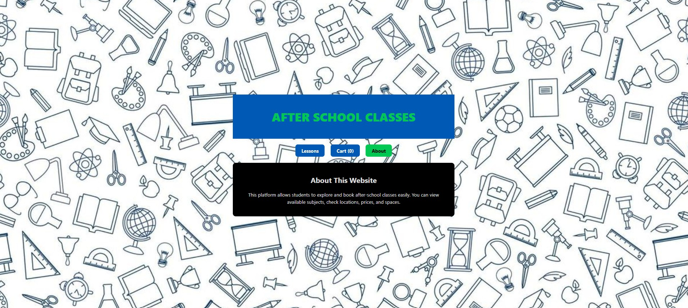

### Cart Page

### About Page
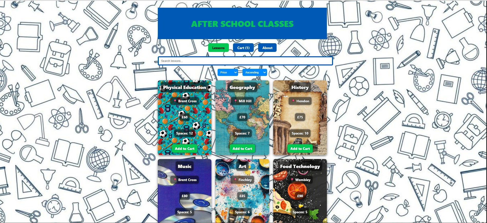

### Order Confirmation 
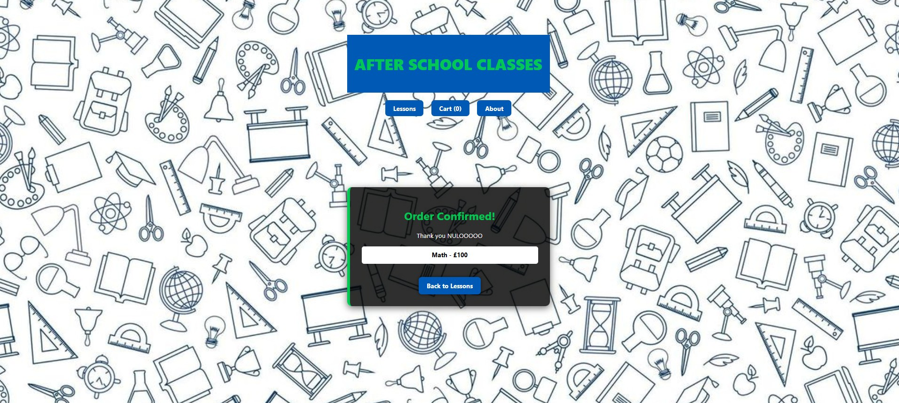

4. Features
Frontend (Vue.js)

View all lessons in a responsive grid

Search bar (filters by subject or location)

Sorting system (subject, location, price, spaces)

Add to Cart / Remove from Cart

Form validation for checkout (name + phone)

Confirmation page after order

Backend (Node.js / Express)

REST API returning all lessons

POST endpoint to create orders

PUT endpoint to update lesson spaces

Search functionality using regex & number matching

MongoDB Atlas connection

Logging middleware

Static image handling

5. Folder Structure

FS-C1/
│
├── backend/
│   ├── routes/
│   ├── server.js
│   ├── package.json
│
├── frontend/
│   ├── public/
│   ├── src/
│   │   ├── App.vue
│   │   ├── components/
│   ├── dist/ (Netlify build)
│   ├── package.json
│
└── README.md

6. Installation & Running the Project
Backend Setup

cd backend
npm install
node server.js
Runs on http://localhost:8080/

Frontend Setup

cd frontend
npm install
npm run dev
Runs on http://localhost:3000/

 7. API Documentation
 GET /lessons

Returns: all lessons
Example Response:

[

  {
    "_id": "673f8c4a2a1fd9",
    "subject": "Math",
    "location": "Hendon",
    "price": 100,
    "spaces": 5
  }
]

POST /orders

Create a new order.

Example Request:
{
  "name": "John Doe",
  "phone": "1234567890",
  "items": [
    { "lessonId": "123", "subject": "Science", "price": 90 }
  ]
}

PUT /lessons/:id

Updates lesson spaces after checkout.

GET /search?q=math

Searches subject/location or numeric fields.

8. Technologies Used
Frontend

Vue.js

Vite

HTML/CSS

Netlify Hosting

Backend

Node.js

Express

MongoDB Atlas

Render Hosting

 9. Error Handling

The system prevents:

Invalid name (must be letters)

Invalid phone number (digits only)

Empty cart checkout

Failed API requests

Missing database connection

On failure, the frontend displays clear error messages.

🧠 10. Challenges & Solutions
1. MongoDB Atlas Connection Errors

When initially connecting to MongoDB Atlas, the IP whitelist caused rejection.
✔ Fixed by allowing "0.0.0.0/0" during development.

2. CORS Issues Between Netlify & Render

Frontend couldn't access backend due to CORS.
✔ Solved by adding:

app.use(cors({ origin: "*" }));

3. Render Not Finding server.js

Render tried to run index.js by default.
✔ Fixed by setting “Start Command” to:

node server.js

4. Images Not Loading in Deployment

Relative paths broke in production.
✔ Solved by switching to:

/images/*.jpg

5. Re-deployment Problems

Frontend still pointed to localhost.
✔ Fixed by updating API_URL in App.vue to live backend.

These challenges improved understanding of deployment, environment configs, and API integration.

11. Accessibility Testing (WAVE)

I used the WAVE Accessibility Tool to evaluate my own website: www.wave.webaim.org

WAVE scans a website for common accessibility issues such as missing text, headings, contrast issues, or anything else that may limit some individuals’ use of the site.

When I tested my live website (https://admirable-dragon-c54ff7.netlify.app/), WAVE indicated:

0 errors - There are no major accessibility issues present

2 alerts - these indicate small suggestions:

No headings - there was no proper heading structure
No landmarks - there were no page regions (using <header> or <aside> for example)
These alerts do not account to failures, just potential enhancements for the future. Overall, the site is accessible and functions well.

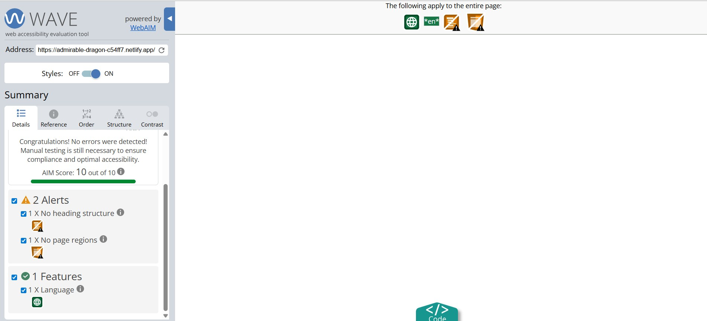

12. Database Evidence (MongoDB Atlas)

As required by the coursework, I included screenshots showing my MongoDB Atlas database setup.
My database is called “Afterschool” and contains two collections:

Lessons – stores all lesson details (subject, location, price, spaces)
Orders – stores order information submitted from the frontend
Collections Overview
Lessons Collection
Orders Collection

These screenshots prove that my backend is correctly connected to MongoDB Atlas and stores the data required for the project.

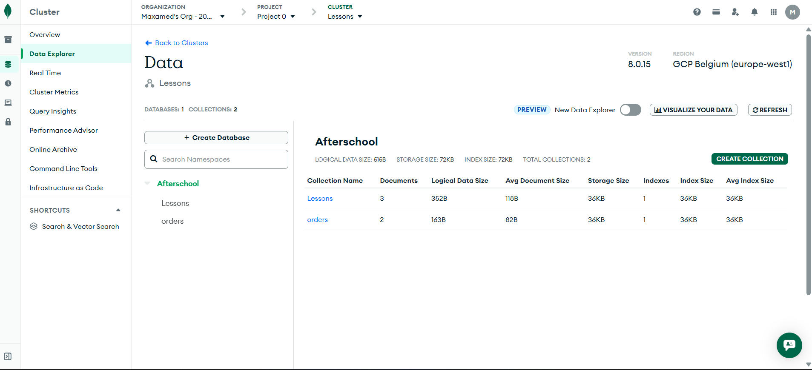
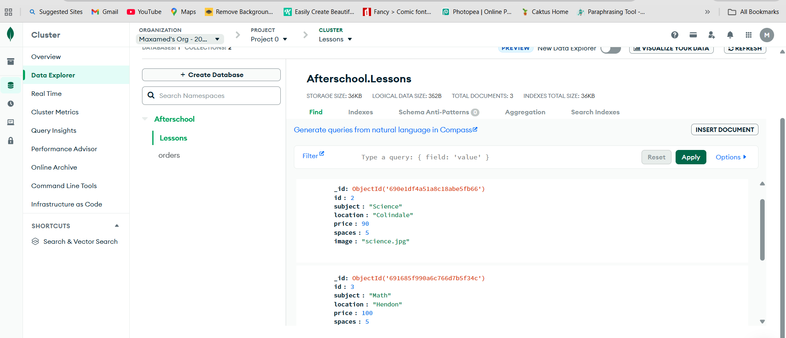
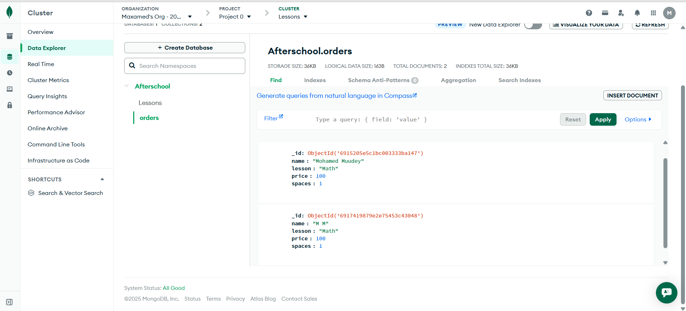

13. API Testing (Postman)

I have fully tested all the backend-endpoints with Postman: GET, POST, PUT and DELETE.
Each test gave the expected response back with status 200 OK or 201 Created.

✔ GET /lessons

✔ GET /orders

✔ POST /orders

✔ PUT /orders/:id

✔ DELETE /orders/:id

These results confirm that:

API routes are working fine.
Data is being read/written to MongoDB
Edge cases like invalid inputs, missing data are handled
All CRUD operations work precisely as required by the coursework.

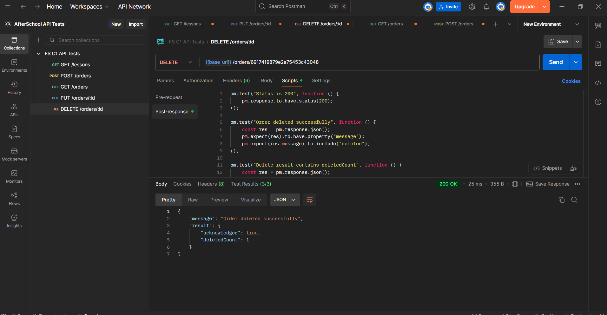
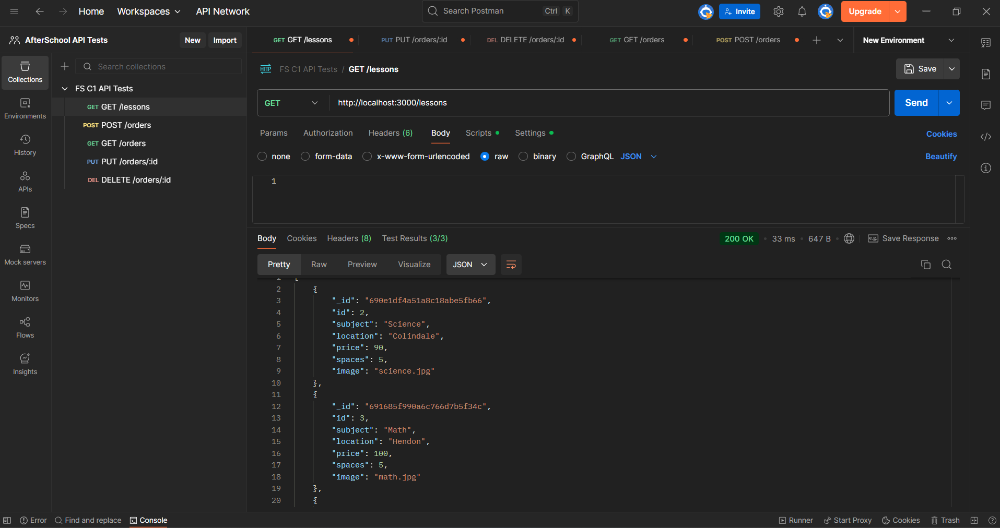
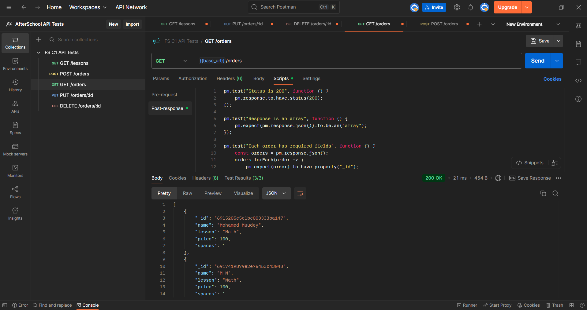
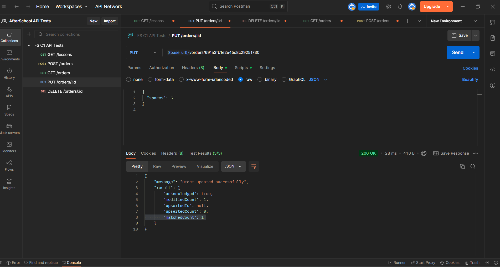

14. Reflection

This project provided an opportunity for me to understand how a full-stack website operates. While the coursework indicated the tools we needed to use, using Vue, Express, and MongoDB demonstrated to me how the frontend, backend, and database all fit together. 

Deploying to Netlify and Render also demonstrated real issues such as CORS, broken links, and troubleshooting API URLs. I learned how everything behaves quite differently in production. 

In summary, I have gained experience with debugging skills, learned about APIs, and developed confidence in creating and deploying a full-stack application.

In the future, I would improve the semantic HTML structure and add proper headings/regions to make the site even more accessible.
